# NOTE

<!--
create time: 2016-03-18 16:43:52
Author: <TODO: 请写上你的名字>

This file is created by Marboo<http://marboo.io> template file $MARBOO_HOME/.media/starts/default.md
本文件由 Marboo<http://marboo.io> 模板文件 $MARBOO_HOME/.media/starts/default.md 创建
-->
>reference: <http://www.runoob.com/css/css-tutorial.html> and <http://www.jikexueyuan.com/course/164_6.html?ss=1>  

## CSS盒子模型概述
<div align=center>
	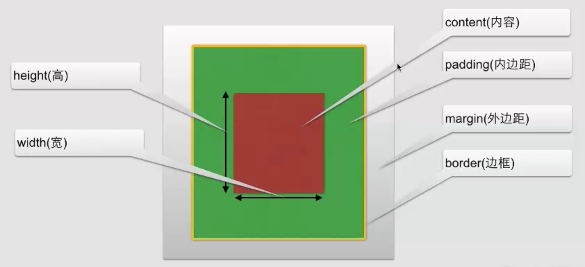
</div>  
CSS盒子模型中，内部红色部分为内容，绿色部分为内边界，黄色线处为边框，外部银白色处外边距。  
可以看到```height```与```width```所指定的高和宽为**内容部分的尺寸**。

### 内边距  
内边距在content外，边框内
#### 内边距属性：

<table width="100%" cellspacing="0" cellpadding="0" border="1" class="reference">
  <tbody><tr>
    <th width="20%" align="left">属性</th>
    <th width="80%" align="left">说明</th>
  </tr>
  <tr>
    <td>padding</td>
    <td>使用缩写属性设置在一个声明中的所有填充属性</td>
  </tr>
  <tr>
    <td>padding-bottom</td>
    <td>设置元素的底部填充</td>
  </tr>
  <tr>
    <td>padding-left</td>
    <td>设置元素的左部填充</td>
  </tr>
  <tr>
    <td>padding-right</td>
    <td>设置元素的右部填充</td>
  </tr>
  <tr>
    <td>padding-top</td>
    <td>设置元素的顶部填充</td>
  </tr>
</tbody></table>

试例：  
  
``` html    
<table border="1">
	<tr>
		<td style="padding: 100px">内边距</td>
	</tr>
</table>
```  
  
上面代码的执行效果如下，会在表格内部```<td>```上下左右各填充100px的空余空间。```padding-right```, ```padding-left```, ```padding-top```, ```padding-bottom```具有类似的语义。
    
<div align=center>
	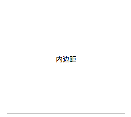
</div> 

### 边框  
1. CSS边框：  
	+ 可以创建出效果出色的边框，并且可以应用于任何元素
2. 边框样式：  
	+ border-style: 定义了10个不同的非继承样式，包括none
3. 边框的单边样式：  
	+ border-top-style  
	+ border-left-style  
	+ border-right-style  
	+ border-bottom-style  
4. 边框的宽度：  
	+ border-width  
5. 边框的单边宽度：  
	+ border-top-width  
	+ border-left-width  
	+ border-right-width  
	+ border-bottom-width  
6. 边框的颜色：  
	+ border-color  
7. 边框的单边颜色：  
	+ border-top-color  
	+ border-left-color  
	+ border-right-color  
	+ border-bottom-color  

#### ```border-style```测试示例：  
我们在```style.css```中编写如下的代码：  
  
``` css 
p{
    width: 100px;
    border-top-style: double;
    border-left-style: dotted;
    border-right-style: groove;
    border-bottom-style: solid;
}
```  
在我们的html编写如下代码:  
    
``` html  
<!DOCTYPE html>
<html lang="en">
<head>
    <meta charset="UTF-8">
    <title>Title</title>
    <link rel="stylesheet" type="text/css" href="style.css">
</head>
<body>
    <p>CSS边框测试</p>
</body>
</html>  
```  
  
在网页中显示效果如下：  
<div align=center>
	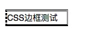
</div> 

#### ```border-width```测试示例：  
我们在```style.css```中添加代码成如下：  
  
``` css 
p{
    width: 100px;
    border-top-style: double;
    border-left-style: dotted;
    border-right-style: groove;
    border-bottom-style: solid;
    border-bottom-width: 10px;
}
```  
  
在网页中显示效果如下：  
<div align=center>
	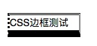
</div>  

#### 其他一些测试示例：  
 
``` css  
p{
    width: 200px;
    border-radius: 10px;
    background-color: aqua;
    text-align: center;
    border: 2px solid red;
    box-shadow: 10px 10px 5px chartreuse;
}
```  
   
效果如下：  
<div align=center>
	
</div> 
  
其中：    

+ ```border-radius```用于设置边框的圆角；  
+ ```border```用于设计边框的边界，第一个参数是线的粗细，第二个参数为边框边界的样式，第三个为颜色；  
+ ```box-shadow```用于设计边框阴影：第一个参数表示向右移动```10px```，第二个参数表示向下移动```10px```，第三个参数表示阴影的透明度，第四个参数表示阴影的颜色。
 


### 外边距  
#### Margin  
margin清除周围的元素（外边框）的区域。margin没有背景颜色，是***完全透明的***  
margin可以单独改变元素的上，下，左，右边距。也可以一次改变所有的属性。  

<table>

  <tbody><tr>
    <th>属性</th>
    <th>描述</th>
  </tr>
  <tr>
    <td>margin</td>
    <td>简写属性。在一个声明中设置所有外边距属性。</td>
  </tr>
  <tr>
    <td>margin-bottom</td>
    <td>设置元素的下外边距。</td>
  </tr>
  <tr>
    <td>margin-left</td>
    <td>设置元素的左外边距。</td>
  </tr>
  <tr>
    <td>margin-right</td>
    <td>设置元素的右外边距。</td>
  </tr>
  <tr>
    <td>margin-top</td>
    <td>设置元素的上外边距。</td>
  </tr>
</tbody></table> 

如下图所示，css代码中为设计```body```的```margin```时，html代码中```<div>```所包裹的部分无法覆盖整个浏览器。这就是body的外边距。  
<div align=center>
	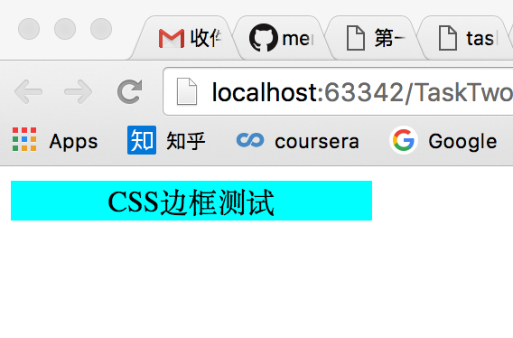
</div>    
当在css中添加如下代码时：  
``` css
body{
margin: 0px;
}
```  
显示效果如下：  
<div align=center>
	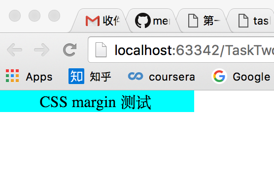
</div>   

### 盒子模型设计综述  
盒子模型在html中用```<div>```来表示，如下：
    
``` html  
    <div class="container">
        <div class="bd">
            <div class="pd">
                <div class="content">
                    CSS盒子模型
                </div>
            </div>
        </div>
    </div>  
```  
在css用代码如下：  
     
``` css  
body{
    margin: 0px;
}
.container{
    margin: 10px;
}
.bd{
    border-style: dotted;
    border-color: #ffccff;
}
.pd{
    padding:10px;
}
.content{
    background-color: green;
    text-align: center;
    color: red;
}    
```  
最后显示效果如下：  
<div align=center>
	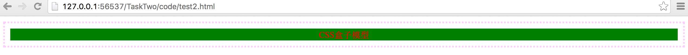
</div>  

### 外边距合并  
外边距合并就是一个叠加的概念  
<div align=center>
	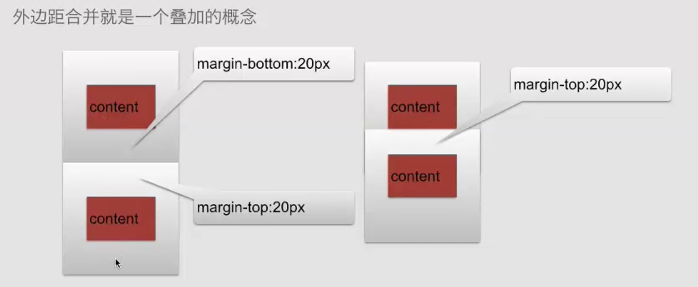
</div> 
两个盒子会自动合并。  

``` html  
    <div class="container">
        <div class="bd">
            <div class="pd">
                <div class="content">
                    CSS盒子模型
                </div>
            </div>
        </div>
    </div>
    <div class="container2">
        <div class="bd2">
            <div class="pd2">
                <div class="content2">
                    CSS盒子模型2
                </div>
            </div>
        </div>
    </div>
```

```css 
body{
    margin: 0px;
}
.container{
     margin: 100px;
 }
.bd{
    border-style: dotted;
    border-color: #ffccff;
}
.pd{
    padding:10px;
}
.content{
    background-color: green;
    text-align: center;
    color: red;
}
.container2{
    margin: 100px;
}
.bd2{
    border-style: dotted;
    border-color: #ffccff;
}
.pd2{
    padding:10px;
}
.content2{
    background-color: green;
    text-align: center;
    color: red;
} 
```
显示效果如下：  
<div align=center>
	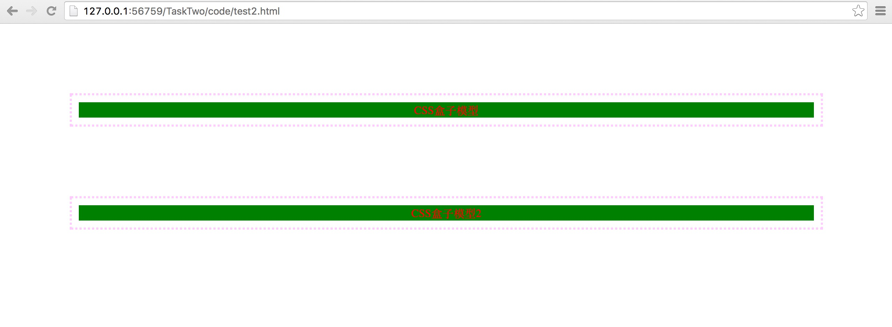
</div>   
如果改变```.container{}```中```margin```的值为```50px```，则显示效果如下：  
<div align=center>
	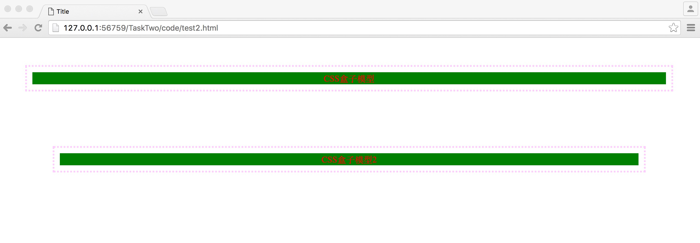
</div>   
merge合并所遵循是多的那一部分。

### CSS3中盒子的类型
```<div>```属于block，```<span>```属于inline，他们的显示效果如下，其中```<div>```占据两行属性，```<span>```为内联元素，占据一行。
<div align=center>
	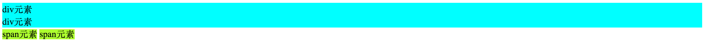
</div>  
通过在```<style>```中定义```display```可以改变其显示属性，代码如下：  

``` html
    <style>
        div{
            background-color: aqua;
            display: inline;
        }
        span{
            background-color: greenyellow;
            display: block;
        }
    </style>
```  
显示效果如下：  
<div align=center>
	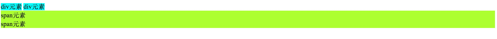
</div>  

#### ```inline-block```属性  
```inline-block```与```inline```具有相同的显示类型，<font color=red>**那么为什么要出现```inline-block```类型呢？**</font>  
```inline```不能改变宽度和高度，但```inline-block```可以设置宽度和高度。如下，我们设置```inline-block```和```inline```的```width```属性都为```300px```，代码如下：  

``` html
    <style>
        div{
            background-color: aqua;
            display: inline-block;
            width: 300px;
        }
        span{
            background-color: greenyellow;
            display: inline;
            width: 300px
        }
    </style>
```  

显示效果如下：  
<div align=center>
	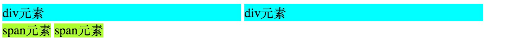
</div>  


 


